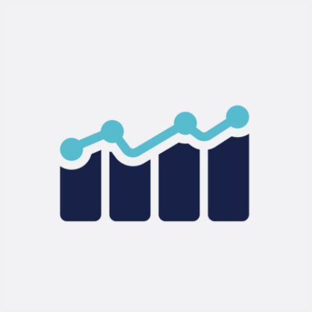

 <!-- Improved compatibility of back to top link: See: https://github.com/othneildrew/Best-README-Template/pull/73 -->
<a name="readme-top"></a>


<!-- PROJECT SHIELDS -->
<!--
*** I'm using markdown "reference style" links for readability.
*** Reference links are enclosed in brackets [ ] instead of parentheses ( ).
*** See the bottom of this document for the declaration of the reference variables
*** for contributors-url, forks-url, etc. This is an optional, concise syntax you may use.
*** https://www.markdownguide.org/basic-syntax/#reference-style-links
-->


<!-- PROJECT LOGO -->
<br />
<div align="center">
  <a href="https://github.com/Yuchen-Dai/stock-search-web">
    
  </a>

<h3 align="center">Stock Search</h3>

  <p align="center">
    Stock search web app with simulate stock trading
    <br />
    <a href="https://stock-search-backend-346009.wl.r.appspot.com/"><strong>View Site »</strong></a>
    <br />

  </p>
</div>

<!-- TABLE OF CONTENTS -->
<details>
  <summary>Table of Contents</summary>
  <ol>
    <li>
      <a href="#about-the-project">About The Project</a>
      <ul>
        <li><a href="#built-with">Built With</a></li>
      </ul>
    </li>
    <li>
      <a href="#getting-started">Getting Started</a>
      <ul>
        <li><a href="#prerequisites">Prerequisites</a></li>
        <li><a href="#installation">Installation</a></li>
      </ul>
    </li>
    <li><a href="#contributing">Contributing</a></li>
    <li><a href="#license">License</a></li>
    <li><a href="#contact">Contact</a></li>
  </ol>
</details>

<!-- ABOUT THE PROJECT -->
## About The Project


The app allows users to search for different stock symbols/tickers and look at the detailed information about them. Additionally, the users can trade with virtual money and create a portfolio. Users can also favorite stock symbols to track their stock prices.<br />
The App contains 3 pages: Search page, watchlist page, and portfolio page.
* Search page
  * The Summary section that shows various stats of the given stock
  * The Top News section that displays the news articles related to the given stock
  * The Charts section that shows the technical indicators about the given stock
  * The Insights section that shows various table and charts of the given stock
* Watchlist page
  * This page will display all the stocks that are added to the watchlist by the user. The page only disaplys simple information of stocks and can navigate to detailed pages by clicking.
* Portfolio page
  * This menu will display all the stocks that have been bought by the user. The user can maintain their stocks here or in search page.

<p align="right">(<a href="#readme-top">back to top</a>)</p>


### Built With

* [![Angular][Angular.io]][Angular-url]
* [![NodeJS][Node.io]][Node-url]
* [![Bootstrap][Bootstrap.com]][Bootstrap-url]
* [![JQuery][JQuery.com]][JQuery-url]


<p align="right">(<a href="#readme-top">back to top</a>)</p>


<!-- GETTING STARTED -->
## Getting Started

This is an example of how you may give instructions on setting up your project locally.
To get a local copy up and running follow these simple example steps.

### Prerequisites

Install Angular CLI
  ```sh
  npm install -g @angular/cli
  ```
### Installation

1. Clone the repo
 ```sh
 git clone https://github.com/Yuchen-Dai/stock-search-web.git
 ```
2. Run
```sh
ng serve
```
Navigate to `http://localhost:4200/`. The application will automatically reload if you change any of the source files.


<!-- CONTRIBUTING -->
## Contributing

Contributions are what make the open source community such an amazing place to learn, inspire, and create. Any contributions you make are **greatly appreciated**.

If you have a suggestion that would make this better, please fork the repo and create a pull request. You can also simply open an issue with the tag "enhancement".
Don't forget to give the project a star! Thanks again!

1. Fork the Project
2. Create your Feature Branch (`git checkout -b feature/AmazingFeature`)
3. Commit your Changes (`git commit -m 'Add some AmazingFeature'`)
4. Push to the Branch (`git push origin feature/AmazingFeature`)
5. Open a Pull Request

<p align="right">(<a href="#readme-top">back to top</a>)</p>


<!-- LICENSE -->
## License

Distributed under the MIT License. See `LICENSE.txt` for more information.

<p align="right">(<a href="#readme-top">back to top</a>)</p>


<!-- CONTACT -->
## Contact

Yuchen Dai - eason.yuchendai@gmail.com

Project Link - [https://github.com/Yuchen-Dai/stock-search-web](https://github.com/Yuchen-Dai/stock-search-web)

<p align="right">(<a href="#readme-top">back to top</a>)</p>


<!-- MARKDOWN LINKS & IMAGES -->
<!-- https://www.markdownguide.org/basic-syntax/#reference-style-links -->
[contributors-shield]: https://img.shields.io/github/contributors/github_username/repo_name.svg?style=for-the-badge
[contributors-url]: https://github.com/Yuchen-Dai/stock-search-web/graphs/contributors
[forks-shield]: https://img.shields.io/github/forks/github_username/repo_name.svg?style=for-the-badge
[forks-url]: https://github.com/Yuchen-Dai/stock-search-web/network/members
[stars-shield]: https://img.shields.io/github/stars/github_username/repo_name.svg?style=for-the-badge
[stars-url]: https://github.com/Yuchen-Dai/stock-search-web/stargazers
[issues-shield]: https://img.shields.io/github/issues/github_username/repo_name.svg?style=for-the-badge
[issues-url]: https://github.com/Yuchen-Dai/stock-search-web/issues
[license-shield]: https://img.shields.io/github/license/github_username/repo_name.svg?style=for-the-badge
[license-url]: https://github.com/Yuchen-Dai/stock-search-web/blob/master/LICENSE.txt
[linkedin-shield]: https://img.shields.io/badge/-LinkedIn-black.svg?style=for-the-badge&logo=linkedin&colorB=555
[linkedin-url]: https://linkedin.com/in/linkedin_username
[product-screenshot]: https://user-images.githubusercontent.com/39274261/199491386-81cf421a-18e0-47f1-92ed-60a1715bffaf.png
[Next.js]: https://img.shields.io/badge/next.js-000000?style=for-the-badge&logo=nextdotjs&logoColor=white
[Next-url]: https://nextjs.org/
[React.js]: https://img.shields.io/badge/React-20232A?style=for-the-badge&logo=react&logoColor=61DAFB
[React-url]: https://reactjs.org/
[Vue.js]: https://img.shields.io/badge/Vue.js-35495E?style=for-the-badge&logo=vuedotjs&logoColor=4FC08D
[Vue-url]: https://vuejs.org/
[Angular.io]: https://img.shields.io/badge/Angular-DD0031?style=for-the-badge&logo=angular&logoColor=white
[Angular-url]: https://angular.io/
[Svelte.dev]: https://img.shields.io/badge/Svelte-4A4A55?style=for-the-badge&logo=svelte&logoColor=FF3E00
[Svelte-url]: https://svelte.dev/
[Laravel.com]: https://img.shields.io/badge/Laravel-FF2D20?style=for-the-badge&logo=laravel&logoColor=white
[Laravel-url]: https://laravel.com
[Bootstrap.com]: https://img.shields.io/badge/Bootstrap-563D7C?style=for-the-badge&logo=bootstrap&logoColor=white
[Bootstrap-url]: https://getbootstrap.com
[JQuery.com]: https://img.shields.io/badge/jQuery-0769AD?style=for-the-badge&logo=jquery&logoColor=white
[JQuery-url]: https://jquery.com 
[Android.com]: https://img.shields.io/badge/Android_Studio-EFEFEF?style=for-the-badge&logo=Android&logoColor=green 
[Android-url]: https://developer.android.com/studio
[Node-url]:https://nodejs.org/en/
[Node.io]: https://img.shields.io/badge/Node.js-EFEFEF?style=for-the-badge&logo=node.js&logoColor=green


